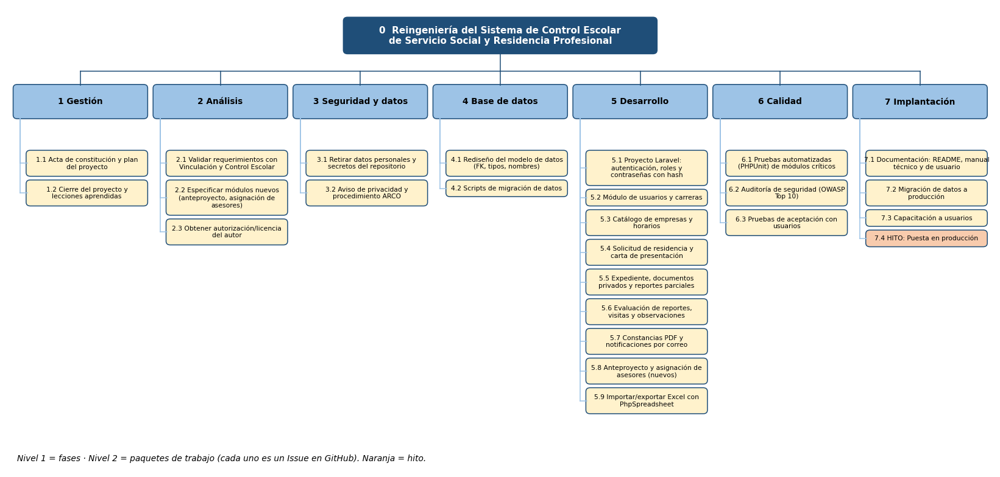

# Práctica 8 – Alcance y EDT

**Consultora NexoSoft** · Pareja 1: [Nombre completo 2] y [Integrante B1]

## 1. Enunciado del alcance

El proyecto moderniza el sistema existente reutilizando lo que ya funciona (requerimientos, modelo de datos y diseño de pantallas) y corrigiendo los riesgos y la deuda técnica identificados en las prácticas 4 y 7.

### Incluido

| # | Qué | De dónde sale |
|---|---|---|
| 1 | Sacar credenciales, secretos, PDFs y respaldos con datos personales del repo y del historial | P7: R01–R08 |
| 2 | Contraseñas con *hash*, cambio obligatorio y recuperación de contraseña funcional | P4 2.4, P7 R02, P3 HU-19 |
| 3 | Documentos subidos en almacenamiento privado, servidos con control de acceso por rol | P7 R05 |
| 4 | Aviso de privacidad y procedimiento ARCO | P7 R18 |
| 5 | Rediseño de BD: FK, tipos, nombres claros, tablas faltantes | P4 |
| 6 | Migración a Laravel 11 / PHP 8.2 (MVC real, sin HTML en controladores) | P2, P7 R12 y R16 |
| 7 | Mantener las funciones actuales: usuarios, carreras, catálogo, solicitud, carta, expediente, reportes, evaluación, visitas, observaciones, constancias e importación/exportación de Excel | P3 HU-01 a HU-19 |
| 8 | Nuevo: registro y dictamen de anteproyecto y asignación de asesores | P3 reflexión 1 |
| 9 | Notificaciones por correo al cambiar el estado de la solicitud | P3 reflexión 1 |
| 10 | Pruebas automatizadas, auditoría de seguridad y pruebas de aceptación | P7 R15 |
| 11 | README, manual de instalación, manual técnico y manual de usuario | P7 R21 |
| 12 | Migración de datos, capacitación y puesta en producción | — |

### Fuera de alcance

- Módulo de exámenes, plan de estudios y notas de materias (heredado; P3 HU-20 = *Won't*).
- Integración con el SII del TecNM.
- Aplicación móvil nativa (el sistema será *responsive*).
- Firma electrónica avanzada de documentos.
- Soporte y mantenimiento después de los 3 meses de garantía.
- Compra de hardware.

## 2. Estructura de Desglose del Trabajo (EDT)

| Fase (nivel 1) | Paquetes de trabajo (nivel 2) |
|---|---|
| 1 Gestión | 1.1 Acta y plan · 1.2 Cierre y lecciones aprendidas |
| 2 Análisis | 2.1 Validar requerimientos · 2.2 Especificar módulos nuevos · 2.3 Autorización del autor |
| 3 Seguridad y datos | 3.1 Retirar datos y secretos del repo · 3.2 Aviso de privacidad y ARCO |
| 4 Base de datos | 4.1 Rediseño del modelo · 4.2 Scripts de migración |
| 5 Desarrollo | 5.1 Base Laravel y autenticación · 5.2 Usuarios y carreras · 5.3 Catálogo · 5.4 Solicitud y carta · 5.5 Expediente y reportes · 5.6 Evaluación, visitas y observaciones · 5.7 Constancias y correo · 5.8 Anteproyecto y asesores · 5.9 Excel |
| 6 Calidad | 6.1 Pruebas automatizadas · 6.2 Auditoría de seguridad · 6.3 Pruebas de aceptación |
| 7 Implantación | 7.1 Documentación · 7.2 Migración a producción · 7.3 Capacitación · 7.4 Hito: puesta en producción |

El seguimiento semanal (juntas y reportes) no se modela como paquete porque es continuo durante las 28 semanas; su costo está dentro del salario del Director / líder técnico.

Cada paquete es un Issue en GitHub (ver `backlog.md`).

## 3. Cronograma

- Archivo: `cronograma.xlsx` (tabla con ES, EF, LS, LF, holgura) y `cronograma.png` (Gantt).
- Inicio: **02/10/2026** · Fin: **18/02/2026** · **28 semanas**.
- **Ruta crítica (16 tareas):** 1.1 → 2.1 → 2.2 → 4.1 → 5.1 → 5.2 → 5.4 → 5.5 → 5.6 → 5.7 → 6.1 → 6.3 → 7.2 → 7.3 → 7.4 → 1.2
- Tareas con más holgura: 3.2 Aviso de privacidad (20 semanas), 4.2 Migración de datos (16), 5.3 y 5.9 Catálogo/Excel (8).
- Punto delicado: 2.3 (autorización del autor) solo tiene **2 semanas de holgura**, y si no se obtiene detiene todo el proyecto (ver R17 en `riesgos-calidad.md`).
